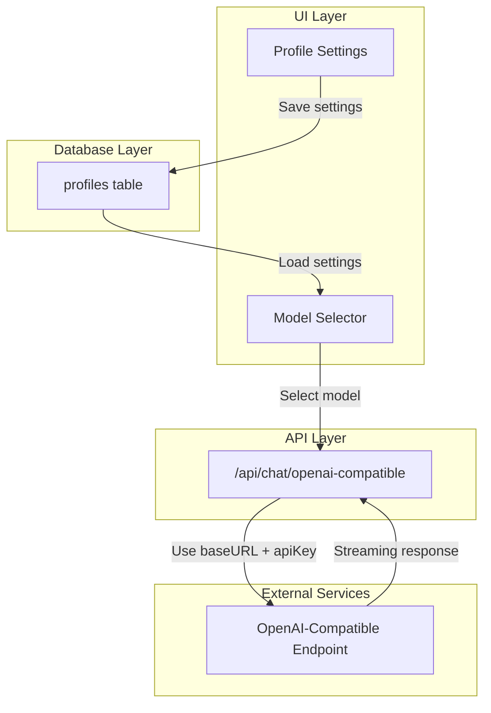

# Design Document: OpenAI-Compatible Provider

## Overview

Fitur ini menambahkan dukungan untuk provider OpenAI-compatible dengan custom base URL. Implementasi mengikuti pattern existing provider (OpenAI, Anthropic) dan memanfaatkan OpenAI SDK yang sudah ada dengan konfigurasi `baseURL` custom.

## Architecture



## Components and Interfaces

### 1. Database Schema Extension

Tambahkan kolom baru ke tabel `profiles`:

```sql
-- New columns for profiles table
openai_compatible_api_key TEXT CHECK (char_length(openai_compatible_api_key) <= 1000),
openai_compatible_base_url TEXT CHECK (char_length(openai_compatible_base_url) <= 1000),
openai_compatible_model_name TEXT CHECK (char_length(openai_compatible_model_name) <= 1000)
```

### 2. API Route

File: `app/api/chat/openai-compatible/route.ts`

```typescript
interface OpenAICompatibleRequest {
  chatSettings: ChatSettings
  messages: any[]
}

// POST handler menggunakan OpenAI SDK dengan custom baseURL
```

### 3. Profile Settings UI Extension

Tambahkan section baru di `components/utility/profile-settings.tsx`:
- Input field untuk API Key
- Input field untuk Base URL
- Input field untuk Model Name

### 4. Model Provider Extension

Update `types/models.ts`:
```typescript
export type ModelProvider =
  | "openai"
  | "google"
  | "anthropic"
  | ... 
  | "openai-compatible"  // New provider
```

### 5. LLM List Extension

Tambahkan OpenAI-compatible ke `lib/models/llm/llm-list.ts` dan buat dynamic model entry.

## Data Models

### Profile Extension

```typescript
interface ProfileOpenAICompatible {
  openai_compatible_api_key: string | null
  openai_compatible_base_url: string | null
  openai_compatible_model_name: string | null
}
```

### OpenAI-Compatible LLM Entry

```typescript
const OPENAI_COMPATIBLE_LLM: LLM = {
  modelId: "openai-compatible" as LLMID,
  modelName: "OpenAI Compatible",
  provider: "openai-compatible",
  hostedId: "openai-compatible",
  platformLink: "",
  imageInput: false
}
```

## Correctness Properties

*A property is a characteristic or behavior that should hold true across all valid executions of a system-essentially, a formal statement about what the system should do. Properties serve as the bridge between human-readable specifications and machine-verifiable correctness guarantees.*

### Property 1: URL Validation Correctness
*For any* input string, the URL validation function SHALL return true only for strings that are valid HTTP/HTTPS URLs with proper format.
**Validates: Requirements 1.2**

### Property 2: Settings Persistence Round-Trip
*For any* valid API key, base URL, and model name combination, saving to profile and then reading back SHALL return the same values.
**Validates: Requirements 1.3**

### Property 3: Model Availability Based on Configuration
*For any* profile with non-empty openai_compatible_api_key and openai_compatible_base_url, the OpenAI-compatible model SHALL appear in the available models list.
**Validates: Requirements 2.1**

### Property 4: Base URL Usage in API Client
*For any* configured base URL, the OpenAI client initialization SHALL use that exact base URL for API requests.
**Validates: Requirements 2.2**

### Property 5: Model Name Propagation
*For any* configured model name, API requests SHALL include that model name in the request payload.
**Validates: Requirements 3.2**

### Property 6: Error Message Extraction
*For any* API error response containing a message field, the system SHALL extract and display that message to the user.
**Validates: Requirements 4.3**

## Error Handling

### Connection Errors
- Timeout: Display "Connection timeout. Please check if the endpoint is accessible."
- Network error: Display "Unable to connect to the endpoint. Please verify the URL."

### Authentication Errors
- 401 Unauthorized: Display "Invalid API key. Please check your OpenAI-compatible API key."
- 403 Forbidden: Display "Access denied. Please verify your API key permissions."

### API Errors
- Extract error message from response body
- Display formatted error with context
- Preserve user input for retry

### Validation Errors
- Invalid URL format: Display "Please enter a valid URL (e.g., http://localhost:1234/v1)"
- Empty required fields: Disable save button and show field-level validation

## Testing Strategy

### Unit Testing
- URL validation function with various inputs
- Error message extraction from different response formats
- Model availability logic based on profile configuration

### Property-Based Testing
Library: **fast-check** (already compatible with Jest setup)

Properties to test:
1. URL validation: Generate random strings and verify validation correctness
2. Settings round-trip: Generate random valid settings and verify persistence
3. Error extraction: Generate random error response structures and verify extraction

### Integration Testing
- Profile settings save/load flow
- API route with mocked OpenAI-compatible endpoint
- Model selector integration with configured provider
