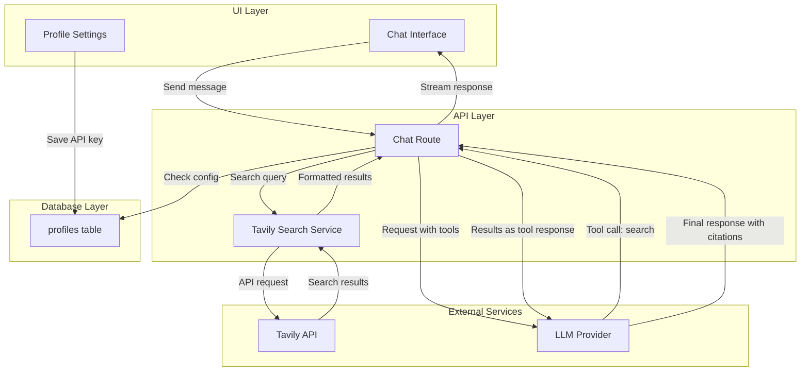

# Design Document: Tavily Web Search Integration

## Overview

Fitur ini mengintegrasikan Tavily AI Search API ke dalam chatbot untuk memberikan kemampuan web search. Tavily adalah search API yang dioptimalkan untuk AI agents, memberikan hasil pencarian yang relevan dan terstruktur. Implementasi menggunakan function calling/tools pattern yang sudah ada di codebase.

## Architecture



## Components and Interfaces

### 1. Database Schema Extension

Tambahkan kolom baru ke tabel `profiles`:

```sql
-- New column for profiles table
tavily_api_key TEXT CHECK (char_length(tavily_api_key) <= 1000)
```

### 2. Tavily Search Service

File: `lib/tools/tavily-search.ts`

```typescript
interface TavilySearchParams {
  query: string
  searchDepth?: "basic" | "advanced"
  maxResults?: number
}

interface TavilySearchResult {
  title: string
  url: string
  content: string
  score: number
}

interface TavilySearchResponse {
  results: TavilySearchResult[]
  query: string
}

async function tavilySearch(
  apiKey: string,
  params: TavilySearchParams
): Promise<TavilySearchResponse>
```

### 3. Tool Definition

File: `lib/tools/tavily-tool-definition.ts`

```typescript
const tavilySearchTool: OpenAI.Chat.Completions.ChatCompletionTool = {
  type: "function",
  function: {
    name: "web_search",
    description: "Search the web for current information about a topic. Use this when you need up-to-date information or facts you don't know.",
    parameters: {
      type: "object",
      properties: {
        query: {
          type: "string",
          description: "The search query to find information about"
        }
      },
      required: ["query"]
    }
  }
}
```

### 4. Chat Route Integration

Update chat routes untuk mendukung Tavily tool:
- Cek apakah Tavily API key tersedia di profile
- Jika tersedia, tambahkan web_search tool ke request
- Handle tool calls untuk web_search
- Format hasil dengan citations

### 5. Profile Settings UI Extension

Tambahkan section di `components/utility/profile-settings.tsx`:
- Input field untuk Tavily API key
- Link ke Tavily untuk mendapatkan API key

## Data Models

### Profile Extension

```typescript
interface ProfileTavily {
  tavily_api_key: string | null
}
```

### Search Result Format

```typescript
interface FormattedSearchResult {
  title: string
  url: string
  snippet: string
}

interface SearchToolResponse {
  results: FormattedSearchResult[]
  sources: string // Formatted citation string
}
```

## Correctness Properties

*A property is a characteristic or behavior that should hold true across all valid executions of a system-essentially, a formal statement about what the system should do. Properties serve as the bridge between human-readable specifications and machine-verifiable correctness guarantees.*

### Property 1: API Key Validation
*For any* input string, the API key validation function SHALL return true only for non-empty strings.
**Validates: Requirements 1.2**

### Property 2: Settings Persistence Round-Trip
*For any* valid Tavily API key, saving to profile and then reading back SHALL return the same value.
**Validates: Requirements 1.3**

### Property 3: Tool Availability Based on Configuration
*For any* profile with non-empty tavily_api_key, the web_search tool SHALL be included in available tools.
**Validates: Requirements 2.1**

### Property 4: Source Formatting Completeness
*For any* list of search results, the formatted output SHALL contain the title and URL of each result.
**Validates: Requirements 3.1, 3.2, 3.3**

### Property 5: Error Message Extraction
*For any* Tavily API error response containing a message field, the system SHALL extract and return that message.
**Validates: Requirements 4.3**

## Error Handling

### Connection Errors
- Timeout: Log error and continue conversation without search results
- Network error: Display "Unable to connect to search service"

### Authentication Errors
- 401 Unauthorized: Display "Invalid Tavily API key. Please check your API key in settings."

### API Errors
- Extract error message from response body
- Log error for debugging
- Continue conversation without search results

### Graceful Degradation
- If search fails, model continues without search results
- User is not blocked from chatting

## Testing Strategy

### Unit Testing
- API key validation function
- Source formatting function
- Error message extraction

### Property-Based Testing
Library: **fast-check** (already compatible with Jest setup)

Properties to test:
1. API key validation: Generate random strings and verify validation correctness
2. Settings round-trip: Generate random valid API keys and verify persistence
3. Source formatting: Generate random search results and verify output contains all required fields
4. Error extraction: Generate random error response structures and verify extraction

### Integration Testing
- Profile settings save/load flow
- Tool availability based on configuration
- End-to-end search flow with mocked Tavily API

